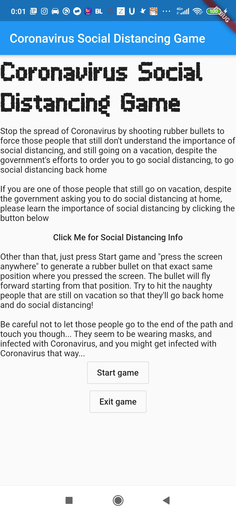
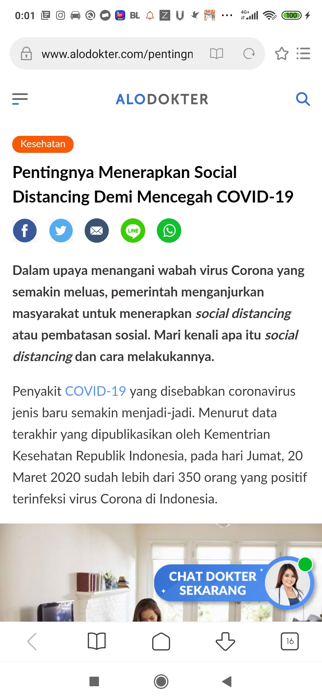
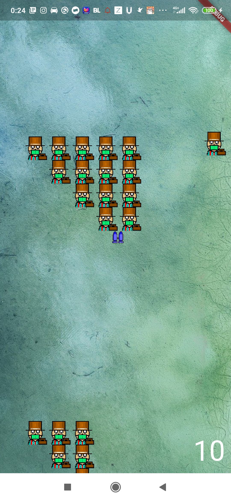
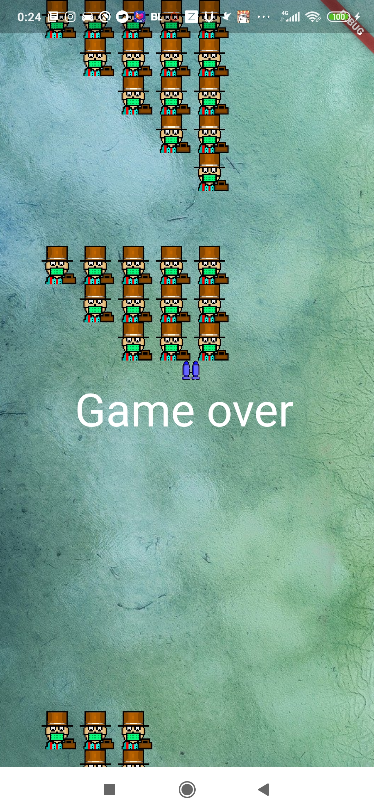

# Coronavirus Social Distancing Game
By Ignatius Timothy Manullang / 13517044
Done to fulfill task requirements of IF3280 Socio-Informatics and Professionalism

## Running instructions
Install flutter, make sure that it's also integrated to environment variables 
Connect a device that is compatible with Flutter 
Open terminal, and type in:

  `flutter run`
  
  Or, if you want to use a pre-compiled apk (Android only), just download the apk from

>   build/app/outputs/apk/app.apk

After downloading the apk, make sure you also check with the sha1 code that is available, just to make sure that the apk you downloaded isn't badly modified in any way when you were downloading it, which is
>  build/app/outputs/apk/app.apk.sha1

After making sure the apk you downloaded isn't badly modified in any way when you were downloading it, copy the apk file into your phone, install it, then just run the app that is installed on your phone.

Happy Playing!

## App Demonstration
### Story
The story of the Coronavirus Social Distancing Game is that the player has to help the government stop the spread of Coronavirus by shooting rubber bullets (Warning Shots) to force those people that still don’t understand the importance of social distancing, and still going on a vacation, despite the government’s efforts to order people to go social distancing, to go social distancing back home.

Explained in a much more fun manner in the game:

> Stop the spread of Coronavirus by shooting rubber bullets to force those people that still don't understand the importance of social distancing, and still going on a vacation, despite the government's efforts to order people to go social distancing, to go social distancing back home

### How to Play
To play the game, press the Start game button in the main menu (which can be seen from the picture above), then press the screen anywhere to generate rubber bullets to convince the naughty people that were on vacation and currently may be infected from Coronavirus on their vacation from touching and visiting you, and make them go back home so that they are able to do Social Distancing back home.

The player loses when one of the people with the mask, going on a vacation, successfully gets near the player, which made the player get infected by the Coronavirus in which the people have gotten from their vacation.

Explained in a much more fun manner in the game:

> Other than that, just press Start game and \"press the screen anywhere\" to generate a rubber bullet on that exact same position where you pressed the screen. The bullet will fly forward starting from that position. Try to hit the naughty people that are still on vacation so that they'll go back home and do social distancing!
> 
> Be careful not to let those people go to the end of the path and touch you though... They seem to be wearing masks, and infected with Coronavirus, and you might get infected with Coronavirus that way...

### Exit Game
To exit the game simply press the exit game button.

### Social Distancing Info
If you are one of the people who is still on vacation,  learn the importance of social distancing by clicking the button that links to Alodokter’s website which explains the importance of social distancing, which is the 

> “Click Me for Social Distancing Info”

 button. This is done so that you are aware of the importance of social distancing and are convinced to stop their vacation to actually do social distancing back home, just like the people who were on vacation in the game after being convinced through a “warning shot” by the player.

Explained in a much more fun manner in the game:

> If you are one of those people that still go on vacation, despite the government asking you to do social distancing at home, please learn the importance of social distancing by clicking the button below
> “Click Me for Social Distancing Info”

### Main Menu
The main menu displays the game logo, story, the social distancing warning for players who are still on vacation, “Click Me for Social Distancing Info” button to link to Alodokter's Website (explained more below), How To Play, Start Game button to start the game, and Exit Game button to exit the game.

Above is the picture for the Main Menu of Coronavirus Social Distancing Game
### Alodokter's Website
Alodokter's website on the importance of social distancing, which is:
> [https://www.alodokter.com/pentingnya-menerapkan-social-distancing-demi-mencegah-covid-19](https://www.alodokter.com/pentingnya-menerapkan-social-distancing-demi-mencegah-covid-19)

will be shown when the player presses the “Click Me for Social Distancing Info” button

### Game Screen
Game Screen is shown after you press the "Start Game" button

A picture of the Game Screen. “People” going on a vacation in groups of 15 from the top of the screen and one lone blue bullet which has made 1 of those “People” go social distancing back home on the right of the screen. Another group of leftover 6 people almost reached the player’s position on the bottom of the screen.
### Game Over
Game Over is shown on the Game Screen when one of the people who were on vacation goes to your position at the bottom of your screen)

Above is a picture of the Game Screen. “People” going on a vacation in groups of 15 from the top of the screen, a lone bullet which has convinced some of the people in the 2nd group in the middle, and people from the 1st group successfully gets near the player’s position at the bottom of the screen, resulting in a Game Over.

  
